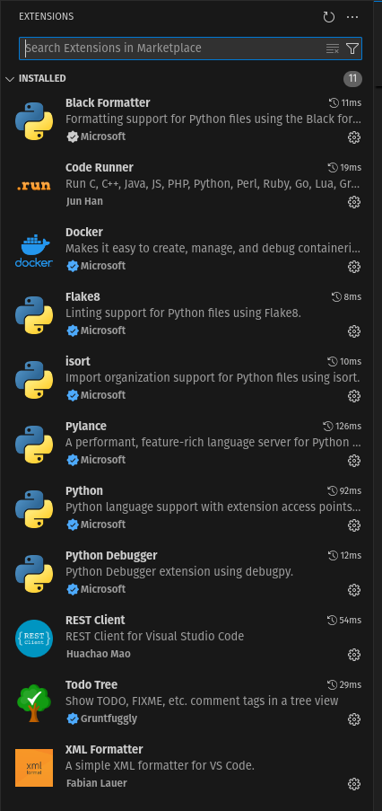

# Tópicos em Python

Anotei aqui alguns tópicos em pyhton. Mas é importante consultar a documentação original da linguagem em:

0. https://www.python.org/

E também outras fontes:

0. https://www.w3schools.com/python/default.asp
0. https://www.geeksforgeeks.org/django-tutorial/
0. https://www.tutorialspoint.com/django/index.htm


## Sumário dos tópicos

Abordaremos:

0. ([hello](hello/readme.md)) Hello word
0. ([comment](comment/readme.md)) Comentários
0. ([print](print/readme.md)) Imprimindo no terminal
0. ([input](input/readme.md)) Lendo do terminal
0. ([type](type/readme.md)) Tipos de variáveis e conversões
0. ([list](list/readme.md)) Listas - list
0. ([dict](dict/readme.md)) Dicionarios - dict
0. ([tuple](tuple/readme.md)) Tuplas - tuple
0. ([set](set/readme.md)) Conjunto - set
0. ([object](object/readme.md)) Caracteristicas em objetos
0. ([flow](flow/readme.md)) Controle e fluxo
0. ([operators](operators/readme.md)) Operadores aritméticos e relacionais
0. ([functions](functions/readme.md)) Funções
0. ([class](class/readme.md)) Classes
0. ([file](file/readme.md)) Lendo e escrevendo em arquivos
0. ([try](try/readme.md)) Tratamento de exceções
0. ([comprehensions](comprehensions/readme.md)) Criando Comprehensions
0. ([lambda](lambda/readme.md)) Criando lambda
0. ([string](string/readme.md)) Manipulando string's
0. ([json](json/readme.md)) Trabalhando com json's
0. ([random](random/readme.md)) Trabalhando com random
0. ([datetime](datetime/readme.md)) Trabalhando com datetime
0. ([requests](requests/readme.md)) Trabalhando com requests
0. ([args](args/readme.md)) Usando args e **kwargs
0. ([\_\_dunder\_\_](dunder/readme.md) ) Usando dunder
0. ([init_package](init_package/readme.md)) Usando \_\_init\_\_.py para indicar pacote
0. ([init_class](init_class/readme.md)) Usando \_\_init\_\_() construtor de classe
0. ([name_main](name_main/readme.md)) Usando if \_\_name\_\_ == '\_\_main\_\_'
0. ([yield](yield/readme.md)) Usando yield


Meu Script para criar pasta
```
mkdir yield; cd yield; touch readme.md; touch code_1.py; cd ..
```
E criar base64 de arquivo de imagem
```
echo "data:image/jpeg;base64,$(base64 -w 0 filename.jpeg)"
```

# Ativar poetry a cada trabalho
```
poetry shell
```

## Format code

https://python.plainenglish.io/migrating-from-flake8-and-black-to-ruff-python-dc91b8a0a243
https://python.plainenglish.io/python-code-formatter-black-or-ruff-b88f8260cf1b
https://learndjango.com/tutorials/pre-commit-django


## Ambiente de desenvolvimento

### Online

Oficialmente usaremos o

0. https://colab.research.google.com/

Outros ambientes python online estão em:

0. https://www.online-python.com/

### Linux
Ou instalar o ambiente localmente. Para Linux segue meu roteiro.

Verificar se o python 3.12 esta ativo
```
  pyenv versions
```

Se nao estiver instalar com 

```
pyenv install 3.12.0
```

Marcar como o compilador local
```
pyenv local 3.12.0
```
Instalar poetry com 
Maior informações sobre o poetry aqui: https://python-poetry.org/docs

```
poetry init

Would you like... no
Would you like... no
```
Conferindo se a pasta .venv foi criada. Senão verifique estas configs
```
poetry config --list

poetry config virtualenvs.create = true
poetry config virtualenvs.in-project = true
```

Instalando pacotes
```
poetry add requests
```
Se já houver um pyproject.toml use apenas o comando a seguir. Ou

Se assim que adicionar com poetry add ele não instalar. Apenas adicionar. Então tem que instalar após add.
```
poetry install
```

Ativar poetry a cada trabalho
```
poetry shell
```

Se o ambiente virtual nao coincidir com o do poetry. apague a pasta .venv e use o comando
Assim ele pega o py correto.
```
poetry env use 3.8
poetry shell
```


#### VSCode
Instale as seguintes extensões:



Para compilar o arquivo prescione: 
``` 
ctrl alt n
``` 

Habilitando verificação de tipagem no VSCode

Crie a seguinte estrutura na raiz de seu projeto
```
.vscode/
└── settings.json
```
E no arquivo settings.json coloque
```
{
  // "python.analysis.typeCheckingMode": "basic"
  "python.analysis.typeCheckingMode": "strict"
}
```


### Mac
Em construção.

### Win
Em construção.

# Temas integrados em Python

## Camparando list, tuple, set, dict

Item | list | tuple | set | dict
---|---|---|---|---
Criada com | list() | tuple()| set()| dict()
Criada vazia | list_1=()|tuple_1=()| set_1=set()|dict_1={}
Mutabilidade | Sim | Não | Sim, mas elementos imutáveis | Sim. Chave é imutável. Valor é mutável
Imutabilidade | Não | Sim | Sim, mas elementos imutáveis | Sim. Chave é imutável. Valor é mutável
Mantem ordem do elementos | Sim | Sim | Não | Sim
Permite valores duplicados | Sim | Sim | Não | Não para chaves
Sintaxe example | [1,'a'] | (1,'a') | {1,'a'} | {'a':'A','b':2,}
Sintaxe type | [Any] | (Any) | {Any} | {str:Any}
Indice | 0 | 0 | Sem indice | Indice é a chave
Adicionar elemento | append() | Não permite | add() | Use 'chave':valor ou update()
Remover elemento | Ultimo com pop() | Não permite | Permite. Mas randomicamente | pop('chave')
Ordenável | sort() | Não permite | Não permite | sorted()
Buscar elemento | index()| index() | Não permite | get('chave')
Reverte elementos | reverse() | Não permite | Não permite | Não permite
Contar elementos | count() |count() |count() |count() 

Alguns tutoriais relacionados:

https://www.naukri.com/code360/library/difference-between-list-tuple-set-and-dictionary-in-python

https://medium.com/@rajputgajanan50/differences-between-list-tuple-set-and-dictionary-in-python-ab47007a7cd9

https://www.scaler.com/topics/python/difference-between-dictionary-list-tuple-and-set-in-python/

https://www.geeksforgeeks.org/differences-and-applications-of-list-tuple-set-and-dictionary-in-python/

https://byjus.com/gate/difference-between-list-tuple-set-and-dictionary-in-python/

https://testbook.com/key-differences/difference-between-list-tuple-set-and-dictionary-in-python


# Outros valores False
```Python
bool(False)
bool(None)
bool(0)
bool("")
bool(())
bool([])
bool({})
```
